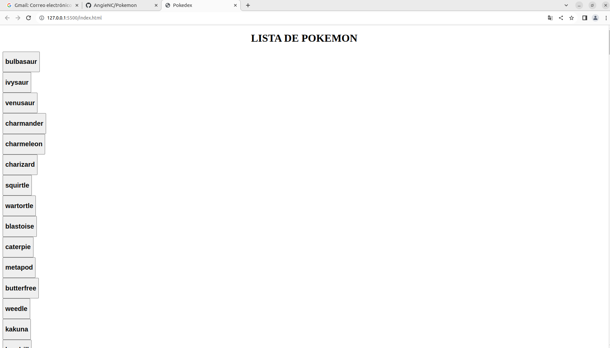

## Proyecto Pokémon

Para este proyecto se pide crear botones que al presionarlos se pueda ver la información de cada uno de ellos gracias a un modal; se habla de los Pokemones, pues esta en la temática.

#### Tecnologías Utilizadas

- HTML
- JavaScript
- PokéAPI
- Archivos JSON

#### Resultado

