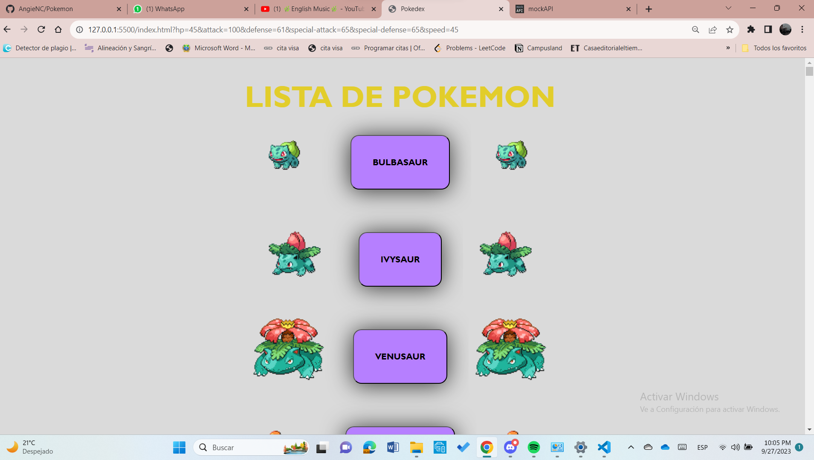
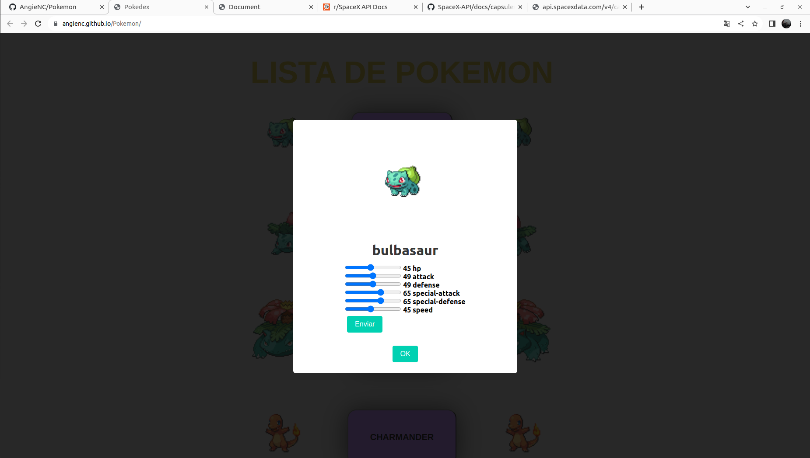

<h1>Proyecto Pokémon</h1>

Para este proyecto se pide crear botones que al presionarlos se pueda ver la información de cada uno de ellos gracias a un modal y puedes jugar con las estadísticas que luego verás en pantalla, todo ello relacionado a  los Pokemones, pues esta en la temática.

#### Objetivo de la página

Facilitarle al usuario los nombres de los 500 primeros pokemon y que pueda conocer las estadísticas de cada uno, además de que el mismo usuario pueda editarlas y guardarlas.

#### Tecnologías Utilizadas

- HTML
- JavaScript
- CSS
- PokéAPI (https://pokeapi.co/)
- Archivos JSON
- Mockapi.io (https://mockapi.io/projects/6509e7ebf6553137159c3aef)

#### ¿Cómo funciona la página?

1. Para saber que contiene, solo debes oprimir en los botones que se te presentan.

2. Una vez que oprimas, te muestra la siguiente ventana con toda la información del pokemón:

   

3. Ahora podrás jugar con sus configuraciones, y se te verán los resultados en la API, pero no en la pantalla.

#### Autora:

Angie Cardenas